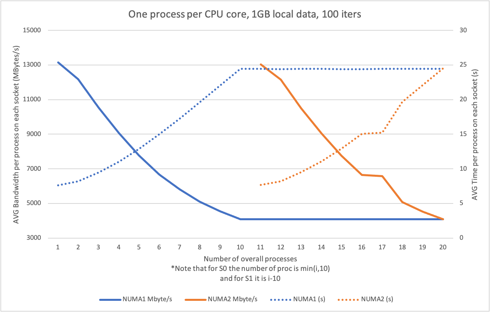
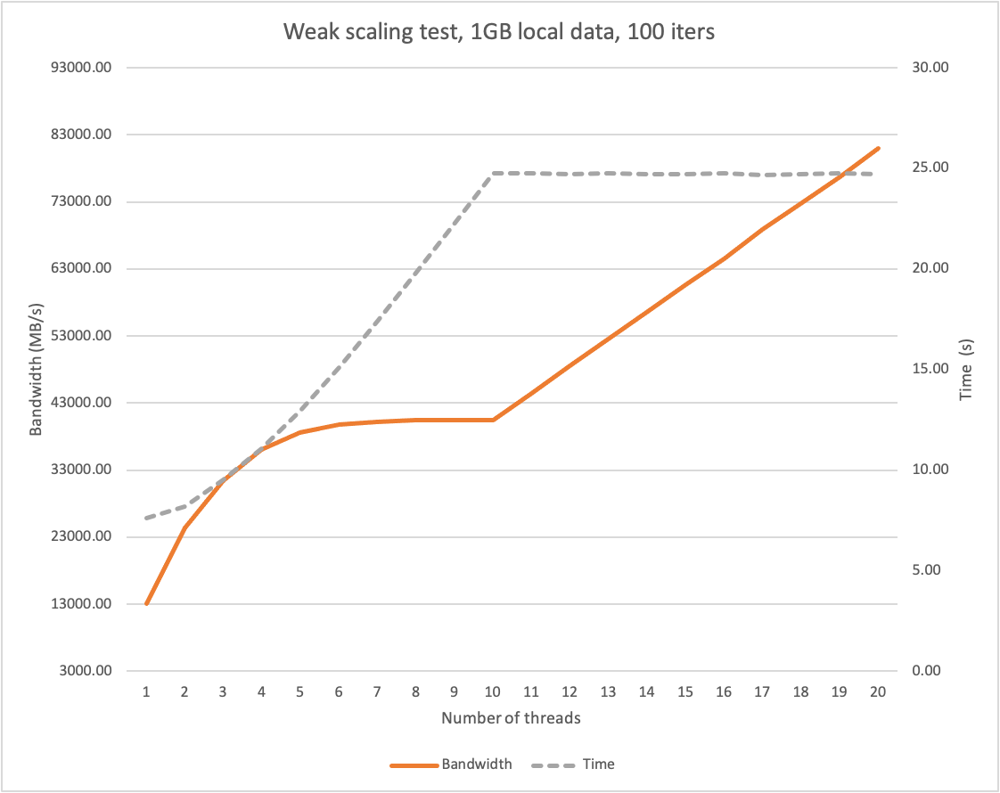

Memory sub-system components contribute significantly to the performance characteristics of an application. As an increasing number of threads or processes share the limited resources of cache capacity and memory bandwidth, the scalability of a threaded application can become constrained. Memory-intensive threaded applications can suffer from memory bandwidth saturation as more threads are introduced. In such cases, the threaded application woun't scale as expected, and performance can be reduced. 

The benchmarks are performed on ICS cluster, where each compute node consists of 2 NUMA domains, each equipped with Intel(R) Xeon(R) Haswell CPU E5-2650 v3 @ 2.30GHz. The weak scaling test is a vector triad program, executed with fixed array size 1GB for each process/thread and performing 100 iterations.

## Running multiple processes
This benchmark suite demonstrates the phenomenon of memory bottleneck. The script `test_proc.sh` incrementally launches more single core processes running on the same compute node until the node is fully occupied (up to 20 processes on the ICS cluster). In the output logs we can observe that the sustained memory bandwidth per process decreases as the number of processes increases, until a single socket is full. When we launch additional process, no. 11, it will be placed to the second socket and thus it will have available all the bandwidth from the second NUMA domain. Additional processes will compete for this bandwidth, similar as in case of launching first 10 processes on the first socket.

The processes are executed as following, where `i` specifies number of processes to launch
```
if [ "$i" -lt 10 ]; then
    #launch first 10 processes on socket 0
    likwid-perfctr -C S0:$i -g L3 likwid-bench -i 100 -t triad -w S0:1000MB:1
else
    #additional processes are placed on socket 1
    likwid-perfctr -C S1:$i -g L3 likwid-bench -i 100 -t triad -w S1:1000MB:1
fi
```



## Running multithreaded process
We can observe similar memory bottleneck problem when running multithreaded applications. The memory bandwidth becomes saturated when running 5-6 threads. Adding threads up to 10 will be limited by the memory. But additional threads, located at the second NUMA domain, will have access to the second memory controller and thus the bandwidth scaling will be linear. The ideal execution time of the weak scaling test is constant. However due to the memory bottleneck the time will increase when increasing number of threads up to saturating the first NUMA domain. Additional threads will not limit the overall time since they have access to the second memory controller. (Note: The overall time will be significantly degraded if the memory is not properly allocated, i.e. first touch. In such case the treads from the second NUMA domain will access data in the first NUMA domain through a slow NUMA interconnect and will additionaly increase the load of the first memory controller, futher worsening the bottleneck. The data thus need to be allocated properly, located within the NUMA domain as the corresponding thread.)



The benchmark is executed as following, where `i` specifies number of threads in first NUMA, `ii` number of threads in the second NUMA domain, `Da` and `Db` are data arrays for each NUMA domain, where it is `i` or `ii` multiple of 1000MB, respectivelly.

```
if [ $i -lt 11  ]; then
    #first 10 threads are placed on S0, Da=1000*i
    likwid-perfctr -C E:N:$i -g L3 likwid-bench -i 100 -t triad -w S0:$Da:$i
else
    #additional threads are located at socket S1, Db=1000*ii, first 10 threads are run on S0
    likwid-perfctr -C E:N:$i -g L3 likwid-bench -i 100 -t triad -w S0:10000MB:10 -w S1:$Db:$ii
fi
```
